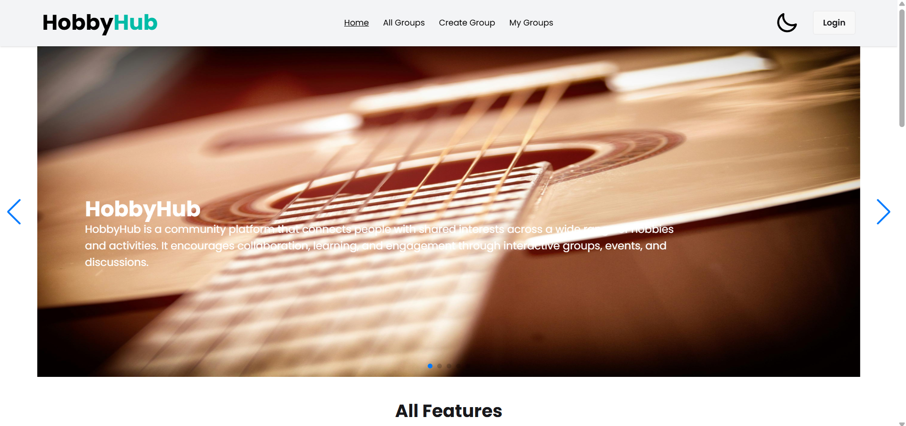

## HobbyHub: Local Hobby Group Organizer

A responsive, full-stack web application that enables users to discover, create, and join local hobby-based groups. This project demonstrates a modern single-page application with protected routes, authentication, responsive design, animations, and a smooth user experience.

## 🔗 Live Site

[🌐 Visit Live Website](https://hobby-hub-client-12859.web.app/)

## 🧰 Tech Stack

- **Frontend:** React.js, React Router, Tailwind CSS
- **Backend:** Node.js, Express.js, MongoDB
- **Authentication:** Firebase Authentication (Email/Password, Google/GitHub OAuth)
- **UI Animations:** Lottie React, React Simple Typewriter, React Awesome Reveal, React Tooltip
- **Notifications:** react-toastify, sweetalert2
- **Others:** Environment variables for security, protected/private routes

## 📸 Screenshot



---

## 📋 Project Overview

This application allows users to:

- Register and log in with email/password or Google/GitHub OAuth
- Create new hobby groups with detailed info (category, description, location, max members, start date)
- View detailed group info and join active groups
- Manage personal groups: update or delete created groups
- Enjoy a responsive and accessible UI with dark/light theme toggle
- Benefit from form validations, toast notifications, and smooth animations

---

## 🚀 Features

### 🧭 Navbar

-Name, navigation links: Home, All Groups, Create Group (private), My Groups (private), Login/Register (conditional)

- Shows user photo and displayName on hover if logged in
- Logout button

### 🦶 Footer

- Contains relevant info and stylish design

### 🏠 Home Page

- Banner/slider with 3+ meaningful slides
- Featured Groups section (limited to 6 ongoing groups)
- Two additional static informational sections

### 🔐 Authentication

- Login with email/password and Google/GitHub OAuth
- Register with validations for password strength and error handling
- Toast/sweet alert notifications for success or errors

### ➕ Create Group Page

- Protected route to create new hobby groups with required fields
- Success toast on creation

### 📄 Group Details Page

- View full group info and join if active
- Protected route

### 📋 All Groups Page

- Display all groups in card or table format
- "See More" buttons to visit group details

### 👤 My Groups Page

- Shows groups created by logged-in user
- Update and delete functionality with confirmation
- Protected route

### ✏️ Update Group Page

- Same form fields as creation page
- Update group details with success feedback
- Optional modal for smoother UX
- Protected route

### ⚠️ Other

- Custom 404 Not Found Page
- Loading spinner during async operations
- Dark/Light theme toggle on homepage
- UI animations using popular React animation libraries
- Disabled joining for groups whose start date has passed with clear messaging

---

## 📦 Dependencies

```json
{
  "dependencies": {
    "@tailwindcss/cli": "^4.1.7",
    "@tailwindcss/vite": "^4.1.7",
    "firebase": "^11.8.1",
    "react": "^19.1.0",
    "react-awesome-reveal": "^4.3.1",
    "react-countup": "^6.5.3",
    "react-datepicker": "^8.3.0",
    "react-dom": "^19.1.0",
    "react-icons": "^5.5.0",
    "react-router": "^7.6.0",
    "react-toastify": "^11.0.5",
    "react-tooltip": "^5.28.1",
    "sweetalert2": "^11.21.2",
    "swiper": "^11.2.7",
    "tailwindcss": "^4.1.7"
  }
}
```

### 🔹 Start Point (Base URL)

- `https://hobby-server-psi.vercel.app`

### 🧍 User API (end point)

- `GET: /user` — Get all users
- `POST: /user` — Create a new user

---

### 🎨 Hobby API (end point)

- `GET: /hobbies` — Get all hobbies
- `GET: /hobbies/:id` — Get a hobby by ID
- `POST: /hobbies` — Create a new hobby
- `PUT: /hobbies/:id` — Update a hobby
- `DELETE: /hobbies/:id` — Delete a hobby

## 🖥️ How to Run Locally

```bash
# Step 1: Clone the repository
git clone https://github.com/parvezreza55/hobbyHub.git

# Step 2: Navigate to the project directory
cd hobbyHub

# Step 3: Install dependencies
npm install

# Step 4: Start the development server
npm run dev
```

## 🔗 Relevant Links

Client Repo: [Repository](https://github.com/parvezreza55/hobbyHub)

Live Site: [Live](https://hobby-hub-client-12859.web.app/)
